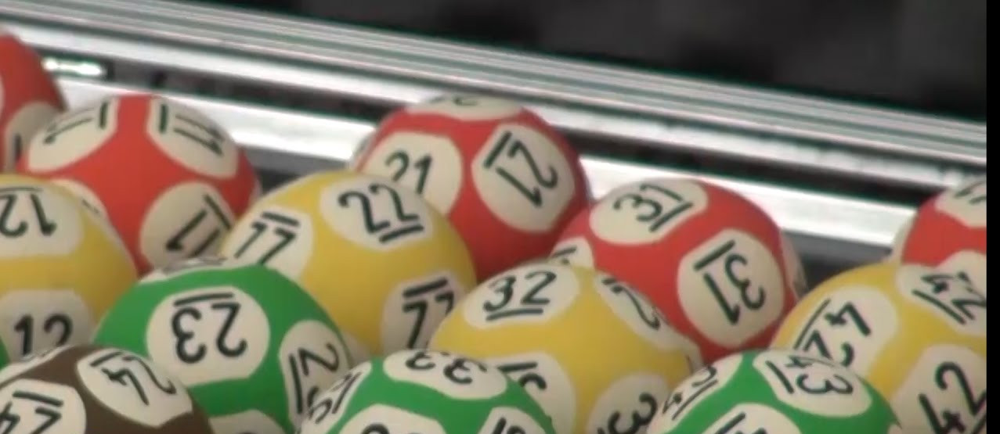

# Megasena



Com o fim de ano vem a Megasena da Virada e aí é aquela dificuldade para escolher os números. Então resolvi me divertir um pouco criando alguns métodos *super científicos* para gerar as minhas apostas. Se você ganhar um prêmio e quiser compartilhar um pouco comigo vou ficar muito feliz. Mas se não quiser compartilhar não tem problema e vou ficar feliz por você mesmo assim.

## Aviso Legal
**NÃO EXISTE MÉTODO CIENTÍFICO PARA GANHAR NA MEGASENA**.
A probabilidade de acertar um jogo de 6 dezenas na Megasena é uma em 50.063.860, independentemente do método utilizado para gerar a aposta. Não se iluda, esse repositório foi criado apenas por brincadeira. Não acredite em métodos ou sistemas para ganhar na Megasena. Isso **NÃO EXISTE**. Não jogue seu dinheiro no lixo acreditando que vai ganhar alguma coisa. É mais fácil [morrer num acidente de avião](https://www.elitedaily.com/news/world/people-terrified-plane-crashes-even-though-rare/977885) do que ganhar na Megasena. Dito isto, continue lendo e divirta-se por sua conta e risco.

## Requisitos
Esse código foi escrito para rodar em Python 3.6+ no REPL. Portanto, recomendo instalar o pacote `ipython` para uma melhor experiência.
Você pode também usar esse código como biblioteca para escrever o seu próprio programa de Megasena ou para outras loterias.

## Explorando o código

### Classe Cage
No arquivo `raffle_cage.py` está declarada a classe `Cage`. Ela serve para simular um globo de sorteio, que é aquela gaiola com as bolas numeradas dentro. O construtor da classe recebe a quantidade de bolas que o globo deve conter e retorna uma instância cheia de bolinhas.

Por exemplo, para iniciar um globo da Megasena, crie uma instância com 60 números.
```
>>> from raffle_cage import Cage
>>> cage = Cage(60)
```

A classe tem dois métodos: `roll` e `alt_roll`. Use o que achar que faz mais sentido. 

O método `roll` sorteia fazendo random da quantidade de bolas que ainda estão dentro do globo e remove a bola sorteada.

O método `alt_roll` faz sempre random da quantidade máxima de bolas e fica tentando até acertar um número que ainda esteja dentro do globo.

Ambos os métodos retornam o número da bola sorteada.
```
>>> ball = cage.roll()
```

Você pode inspecionar o globo olhando os atributos `pending` e `drawn`.

### Funções da Megasena
Aqui é onde a diversão acontece. Antes de começar, convém gerar um csv atualizado com a lista de resultados acumulados. Qual o fundamento de olhar para os resultados anteriores? A probabilidade de um jogo se repetir é a mesma de qualquer jogo ser sorteado, uma em 50.063.860. Portanto, achei razoável excluir os jogos que já foram sorteados. Se você olhar o histórico de quase 2.500 jogos, vai ver que ainda não houve uma repetição. Mas lembre-se: não há qualquer ciência nisso. A probabilidade de qualquer jogo acontecer é exatamente a mesma.

#### Gerando o CSV de resultados
- Vá no site da Caixa Econômica e baixe o [arquivo com os resultados](http://www1.caixa.gov.br/loterias/_arquivos/loterias/D_mgsasc.zip).
- Descompacte o arquivo para extrair o html com os resultados.
- Abra o html no LibreOffice Calc ou no Excel.
- Copie o conteúdo das colunas C a H **sem os cabeçalhos** e cole em uma nova planilha.
- Salve a nova planilha como CSV delimitado por vírgulas (",") na pasta do projeto, sobrepondo o arquivo `resultados.csv`.

#### Funções

##### play_one(cage, dezenas)
Gera um jogo com a quantidade de `dezenas` extraindo bolas do globo `cage`. O mesmo globo pode ser usado até acabarem as bolas. Observe que os jogos gerados com um mesmo globo não terão dezenas repetidas.
```
>>> cage = Cage(60)
>>> play_one(cage, 6)
[1, 7, 8, 32, 35, 60]
>>> play_one(cage, 6)
[3, 10, 11, 39, 52, 54]
```

##### play(dezenas, history, local_history)
Instancia um globo com 60 bolas e gera jogos com o número especificado de dezenas até as bolas se esgotarem. Para evitar jogos que já aconteceram no passado, o parâmetro `history` deve receber um array com os resultados de todos os concursos anteriores. O parâmetro `local_history` pode receber os jogos gerados durante uma sessão `play_cages** para evitar jogos repetidos na mesma sessão.

A função retorna uma tupla com 3 listas:
- Os jogos extraidos de um globo com 60 bolas
- Os jogos gerados que coincidiram com a história de concursos anteriores
- Os jogos repetidos dentro da mesma sessão

```
>>> play(6, get_history(), [])
([[1, 4, 10, 19, 36, 53],
  [2, 7, 23, 27, 37, 38],
  [3, 5, 8, 20, 35, 55],
  [6, 31, 39, 41, 47, 59],
  [9, 12, 21, 24, 28, 56],
  [11, 16, 32, 45, 48, 49],
  [13, 22, 30, 43, 46, 51],
  [14, 25, 33, 40, 58, 60],
  [15, 17, 26, 34, 42, 44],
  [18, 29, 50, 52, 54, 57]],
 [],
 [])

```

##### play_cages(cages_count, dezenas)
Gera jogos com o número de dezenas especificado em `dezenas` extraidos da quantidade de globos recebida em `cages_count`.

```
>>> play_cages(2, 6)
([[1, 6, 13, 21, 35, 52],
  [2, 9, 15, 36, 47, 48],
  [3, 5, 12, 46, 51, 53],
  [4, 7, 18, 29, 41, 49],
  [8, 17, 23, 39, 42, 45],
  [10, 19, 27, 32, 55, 59],
  [11, 26, 30, 43, 56, 58],
  [14, 22, 40, 50, 54, 60],
  [16, 24, 25, 31, 38, 57],
  [20, 28, 33, 34, 37, 44],
  [1, 4, 28, 52, 55, 56],
  [2, 14, 22, 24, 44, 46],
  [3, 16, 19, 25, 39, 40],
  [5, 30, 35, 36, 41, 50],
  [6, 7, 10, 27, 29, 31],
  [8, 12, 13, 34, 47, 48],
  [9, 15, 21, 32, 42, 59],
  [11, 17, 26, 37, 57, 58],
  [18, 20, 51, 53, 54, 60],
  [23, 33, 38, 43, 45, 49]],
 [],
 [])

```

##### play_and_save(cages_count, instance_number)
Roda `play_cages` com o `cages_count` recebido e 6 dezenas e salva o resultado em um CSV nomeado com `instance_number`. Criei essa função para gerar um número enorme de jogos para depois procurar as repetições com maior incidência. Para isso é preciso fazer a seguinte alteração na função `play_cages`:
```
          # substituir essa linha
          games, found, local_found = play(dezenas, history, all_games)
          
          # por essa
          games, found, local_found = play(dezenas, history, [])

```
para que a função `play` não despreze as repetições.

##### play_and_save_many(cages_count, how_many_times)
Roda a função `play_and_save` `how_many_times` vezes, com o número de globos `cages_count`.
O exemplo abaixo gera aproximadamente 10 milhões de jogos distribuidos em 500 arquivos (excluindo as repetições encontradas no histórico).
```
>>> play_and_save_many(2000, 500)
```

##### consolidate(instances_count, path=".")
Consolida os resultados gravados nos CSV's gerados `instances_count` vezes por `play_and_save`.

##### consolidate_and_group(instances_count)
Consolida chamando `consolidate` e agrupa os resultados.
De cada globo com 60 bolas é possível gerar 10 jogos de 6 dezenas. Portanto, o exemplo abaixo gera 500 resultados - `5 globos x 10 jogos x 10 vezes = 500 jogos`.
```
>>> play_and_save_many(5, 10)
times:  0                                                                    
times:  1                                                                    
times:  2                                                                    
times:  3                                                                    
times:  4                                                                    
times:  5                                                                    
times:  6                                                                    
times:  7                                                                    
times:  8                                                                    
times:  9                                                                    

>>> consolidate_and_group(10)
{'[1, 2, 4, 14, 43, 47]': {'count': 1, 'value': [1, 2, 4, 14, 43, 47]},      
 '[1, 2, 9, 32, 40, 44]': {'count': 1, 'value': [1, 2, 9, 32, 40, 44]},      
 '[1, 2, 11, 12, 25, 43]': {'count': 1, 'value': [1, 2, 11, 12, 25, 43]},    
 '[1, 2, 19, 38, 44, 54]': {'count': 1, 'value': [1, 2, 19, 38, 44, 54]},    
 '[1, 4, 5, 7, 9, 51]': {'count': 1, 'value': [1, 4, 5, 7, 9, 51]},          
 '[1, 4, 16, 37, 41, 45]': {'count': 1, 'value': [1, 4, 16, 37, 41, 45]},    
                            ...
 '[32, 34, 35, 40, 48, 52]': {'count': 1, 'value': [32, 34, 35, 40, 48, 52]},
 '[33, 46, 48, 49, 52, 56]': {'count': 1, 'value': [33, 46, 48, 49, 52, 56]}}
```

##### filter_dict(d, filter_fn)
Permite filtrar um conjunto muito grande de resultados de `consolidate_and_group` para obter, por exemplo, somente os jogos que foram gerados mais de um certo número de vezes.
```
>>> play_and_save_many(1000, 10)
times:  0                                        
times:  1                                        
times:  2                                        
times:  3                                                                    
times:  4                                        
times:  5                                        
times:  6                                        
times:  7
times:  8
times:  9

>>> filter_dict(consolidate_and_group(10), lambda x: x.get("count") > 1)
[{'count': 2, 'value': [1, 2, 4, 14, 43, 47]},                               
 {'count': 2, 'value': [1, 2, 9, 32, 40, 44]}
                  ...
 {'count': 2, 'value': [32, 34, 37, 41, 44, 57]}]

```

##### count_frequency(games, dezena)
Conta a frequência com que cada número ocorreu como uma determinada dezena em um conjunto de jogos. Por exemplo, para saber quanto cada número ocorreu como primeira dezena em todos os concursos anteriores:
```
>>> history = get_history()
>>> count_frequency(history, 0)
{4: 187,
 9: 97, 
 10: 113,
 1: 221,
 7: 136,
 3: 168,
   ...
 34: 1,
 41: 1,
 50: 1}
```

Para saber quais foram os 5 números que mais ocorreram como primeira dezena em toda a história da megasena:
```
>>> list(reversed(sorted([[v, k] for k,v in count_frequency(history, 0).items()])[-5:]))
[[221, 1], [205, 2], [187, 4], [168, 3], [162, 5]]
```
